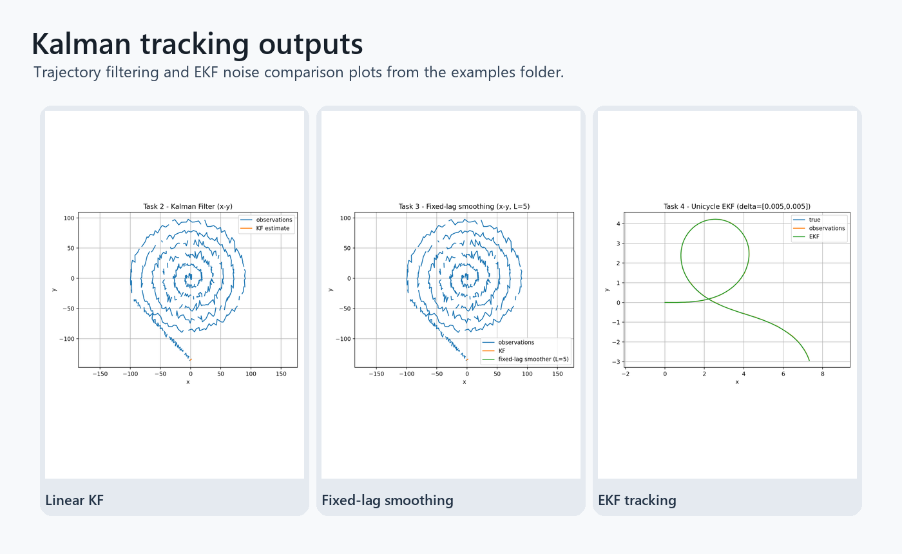

# Kalman Filter Tracking

Tracking experiments with linear Kalman filtering, fixed-lag smoothing, and an extended Kalman filter for a nonlinear unicycle model.

## Highlights

- Implements a constant-velocity linear Kalman filter.
- Adds fixed-lag smoothing from the forward filter pass.
- Simulates and tracks nonlinear unicycle motion with an EKF.
- Exports XY trajectory plots and component-level diagnostics.

## Repository Layout

- `tracking_filters.py` - filtering, smoothing, simulation, and plotting code.
- `data/observations.npy` - observation sequence.
- `examples/` - generated trajectory and component plots.

## Setup

```bash
pip install -r requirements.txt
```

## Run

```bash
python tracking_filters.py
```

## Tracking output



Trajectory and component plots for Kalman filtering, smoothing, and EKF tracking experiments.


## Filter workflow

- Linear Kalman filtering and fixed-lag smoothing on tracking data.
- EKF-style nonlinear tracking experiments with noise comparisons.
- Generated figures that expose both XY trajectory and state-component behavior.


## Follow-up validation

- The examples use prepared observations rather than live detector input.
- Noise models are manually selected for the bundled experiments.
- Next steps: add detector integration and a parameter sweep report.

